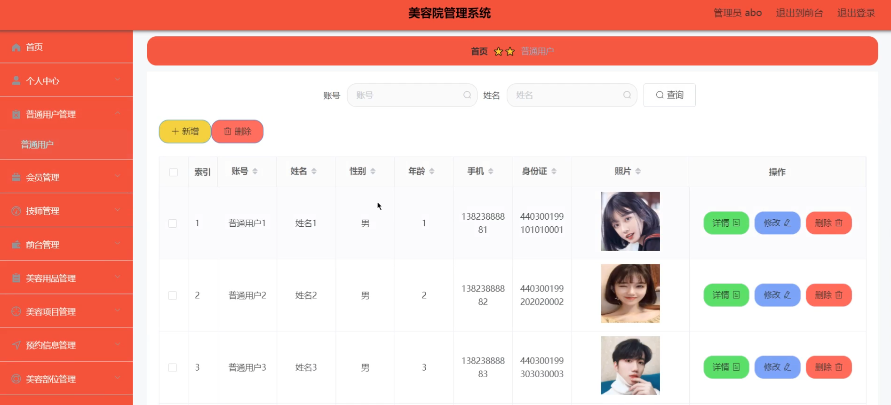
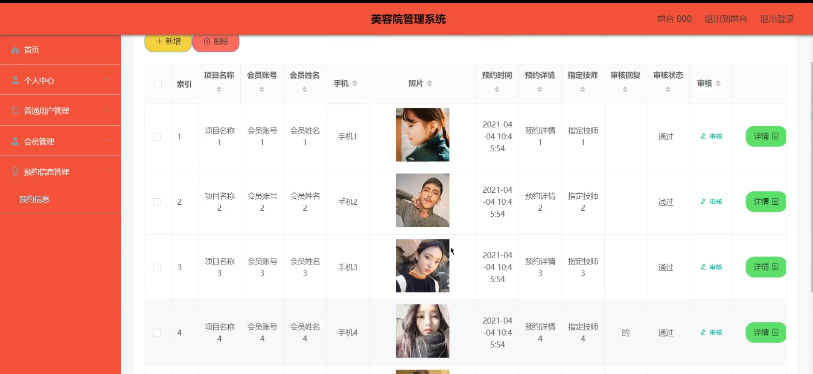

# 基于SSM的美容院管理系统

#### 介绍

在美容行业快速发展的背景下，美容院的高效管理和优质服务至关重要。然而，传统管理模式往往存在信息混乱、服务效率低下等问题。为了解决这些问题并提升管理水平，我开发了一个基于SSM（Spring、SpringMVC、MyBatis）的美容院管理系统。该系统旨在通过信息化手段，提升美容院的管理效率和服务质量，为客户提供更好的体验。

#### 技术栈

后端技术栈：Springboot+Mysql+Maven

前端技术栈：Vue+Html+Css+Javascript+ElementUI

开发工具：Idea+Vscode+Navicate

#### 系统功能介绍

管理端功能模块  
个人中心：管理员可以查看和编辑个人信息，管理个人账户和密码。  
普通用户管理：管理普通用户的基本信息，包括新增、修改和删除用户。  
会员管理：管理美容院会员的详细信息，包含会员等级、优惠政策等。  
技师管理：管理美容院技师的基本信息和工作安排。  
前台管理：管理前台工作人员的基本信息和职责分配。  
美容用品管理：管理美容院的美容用品库存、采购和使用情况。  
美容项目管理：管理美容院提供的各类美容项目，包括项目描述、价格等。  
预约信息管理：管理用户的预约信息，确保预约流程的顺畅和高效。  
美容部位管理：管理美容项目涉及的身体部位信息。  
系统管理：设置和管理系统参数，确保系统的稳定运行。  
订单管理：管理美容服务的订单信息，包括订单生成、处理和跟踪。  

技师端功能模块  
美容用品：查看和管理技师所需的美容用品信息。  
美容项目：查看和管理技师负责的美容项目。  
预约信息：查看用户的预约信息，合理安排工作时间。  
个人中心：查看和编辑技师的个人信息，管理个人账户和密码。  

后台管理：  
美容用品管理：管理技师需要的美容用品库存和使用情况。  
美容项目管理：管理技师负责的美容项目详情。  
预约信息管理：管理用户的预约信息，确保按时提供服务。  
购物车：管理技师需要采购的美容用品。  

前台端功能模块  
个人中心：查看和编辑前台人员的个人信息，管理个人账户和密码。  
普通用户管理：管理来访的普通用户信息，帮助用户登记和查询。  
会员管理：管理会员信息，帮助会员办理相关手续和服务。  
预约信息管理：管理用户的预约信息，确保前台操作的准确性和高效性。  

#### 系统作用

对管理端的作用  
高效管理用户和会员：通过普通用户管理和会员管理模块，管理员可以便捷地管理用户和会员信息，包括新增、修改、删除用户和会员信息，方便进行会员等级和优惠政策的管理。  
技师和前台人员的有效管理：技师管理和前台管理模块帮助管理员有效地安排和监督技师和前台人员的工作，确保美容院服务的高效性和质量。  
美容用品和项目的精准管理：美容用品管理和美容项目管理模块使管理员能够实时了解库存情况，合理安排采购计划，并确保美容项目的信息准确无误。  
优化预约流程：通过预约信息管理模块，管理员可以高效地管理用户的预约信息，避免预约冲突，提高用户满意度。  
细致的美容部位管理：美容部位管理模块帮助管理员精确管理每个美容项目涉及的身体部位，确保服务的专业性和细致度。  
综合系统管理：系统管理模块提供了对系统参数的设置和管理功能，确保系统的稳定运行。  
全面的订单管理：订单管理模块使管理员能够高效处理美容服务订单，包括生成、处理和跟踪订单，提高订单处理效率。  

对技师端的作用  
美容用品的管理和使用：技师可以通过美容用品模块查看和管理所需的美容用品信息，确保美容用品的充足供应。  
美容项目的高效管理：美容项目模块使技师能够清楚了解和管理自己负责的美容项目，提供优质服务。  
精准的预约管理：通过预约信息模块，技师可以合理安排工作时间，避免预约冲突，提高工作效率。  
个人信息的便捷管理：个人中心模块使技师能够查看和编辑个人信息，确保信息的准确性。  
后台管理功能：后台管理模块下的美容用品管理、美容项目管理和预约信息管理功能，使技师能够更好地管理工作所需的各项资源和信息。  
采购管理：购物车模块帮助技师管理需要采购的美容用品，方便及时补充所需物资。  

对前台端的作用  
用户和会员管理：通过普通用户管理和会员管理模块，前台人员可以高效管理来访用户和会员信息，提供良好的服务。  
预约信息的精准处理：预约信息管理模块使前台人员能够准确登记和查询用户的预约信息，确保服务的及时性和准确性。  
个人信息的便捷管理：个人中心模块帮助前台人员查看和编辑个人信息，确保信息的准确性。  
信息管理：通过公告信息管理模块，前台人员能够及时了解和传达美容院的重要信息和通知，保持信息的畅通。  

#### 系统功能截图

代码结构

数据库表

登录

用户管理

技师管理

前台管理

美妆用品管理

预约信息管理

技师端后台管理

美容项目

预约信息管理

技师端前台页面

前台端页面

#### 总结

基于SSM的美容院管理系统通过细致的功能模块设计，全面提升了美容院的管理效率和服务质量。管理端能够高效管理美容院的各项事务，技师端能够合理安排和执行工作，前台端则能够高效服务来访客户。这些功能的实现不仅优化了内部管理流程，还为客户提供了更优质的服务体验，从而显著提升了美容院的整体运营水平。

#### 使用说明

创建数据库，执行数据库脚本 修改jdbc数据库连接参数 下载安装maven依赖jar 启动idea中的springboot项目

后台地址：http://localhost:8080/springbootsw863/admin/dist/index.html

管理员  abo 密码 abo

前台地址：http://localhost:8080/springbootsw863/front/index.html
